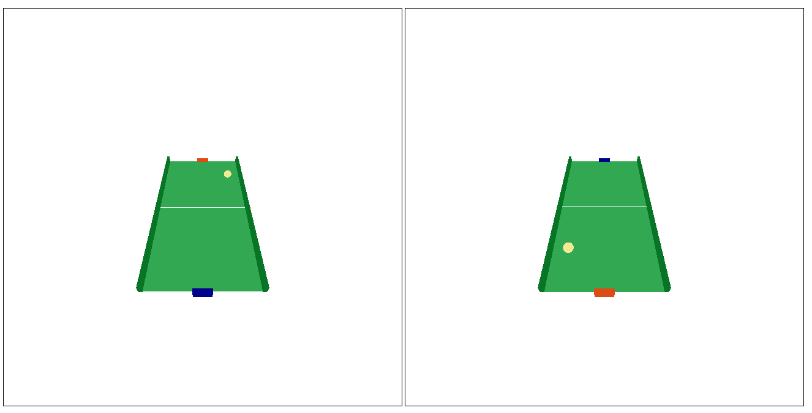

# pong_game

This is a pong game which I have created as an assigment for my Computer graphics class.
It is built with THREE.js library, the files three.min.js and TrackballControls.js are standard files and were provided.

The game has to modes: single and multiplayer which can be chosen at the beginning of the game.
The red racket is moved with arrow keys and the blue racket is moved with letters "a" and "s".

